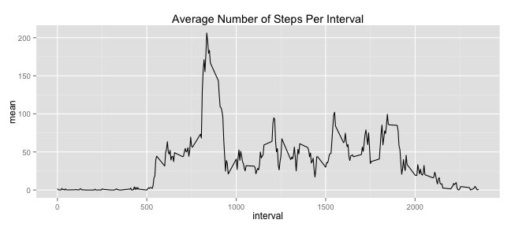
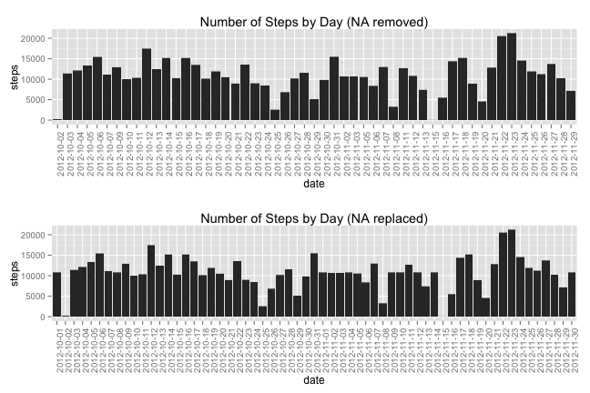
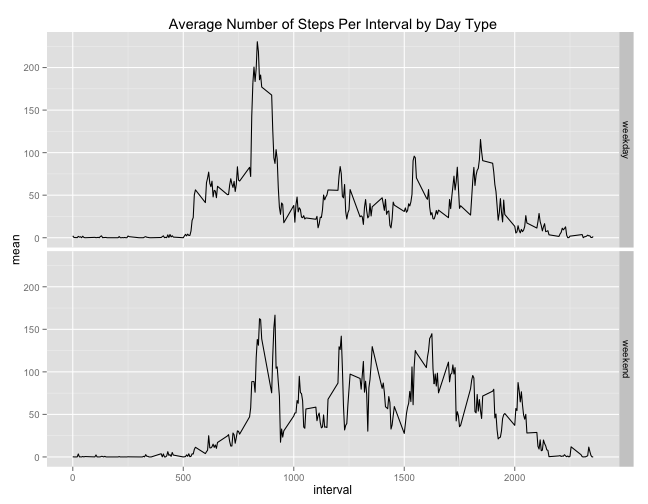

Programming Assignment 1- Reproducible Research
========================================================
### By Paul Nguyen

## Loading and preprocessing the data


```r
data <- read.csv("activity.csv")
dataComplete <- data[complete.cases(data),]
```


## What is mean total number of steps taken per day?

Make a histogram of the total number of steps taken each day with the NA values removed.


```r
library(ggplot2)
p1 <- ggplot(dataComplete, aes(x=date, y=steps))+geom_histogram(stat="identity")
p1 <- p1 + theme(axis.text.x = element_text(angle = 90, hjust = 1))
p1 <- p1 + labs(title="Number of Steps by Day (NA removed)")
p1
```

 

Calculate and report the mean and median total number of steps taken per day


```r
library(data.table)
dt <- data.table(dataComplete)
dt[,list(mean=mean(steps),median=median(steps)), by=date]
```

```
##           date    mean median
##  1: 2012-10-02  0.4375      0
##  2: 2012-10-03 39.4167      0
##  3: 2012-10-04 42.0694      0
##  4: 2012-10-05 46.1597      0
##  5: 2012-10-06 53.5417      0
##  6: 2012-10-07 38.2465      0
##  7: 2012-10-09 44.4826      0
##  8: 2012-10-10 34.3750      0
##  9: 2012-10-11 35.7778      0
## 10: 2012-10-12 60.3542      0
## 11: 2012-10-13 43.1458      0
## 12: 2012-10-14 52.4236      0
## 13: 2012-10-15 35.2049      0
## 14: 2012-10-16 52.3750      0
## 15: 2012-10-17 46.7083      0
## 16: 2012-10-18 34.9167      0
## 17: 2012-10-19 41.0729      0
## 18: 2012-10-20 36.0938      0
## 19: 2012-10-21 30.6285      0
## 20: 2012-10-22 46.7361      0
## 21: 2012-10-23 30.9653      0
## 22: 2012-10-24 29.0104      0
## 23: 2012-10-25  8.6528      0
## 24: 2012-10-26 23.5347      0
## 25: 2012-10-27 35.1354      0
## 26: 2012-10-28 39.7847      0
## 27: 2012-10-29 17.4236      0
## 28: 2012-10-30 34.0938      0
## 29: 2012-10-31 53.5208      0
## 30: 2012-11-02 36.8056      0
## 31: 2012-11-03 36.7049      0
## 32: 2012-11-05 36.2465      0
## 33: 2012-11-06 28.9375      0
## 34: 2012-11-07 44.7326      0
## 35: 2012-11-08 11.1771      0
## 36: 2012-11-11 43.7778      0
## 37: 2012-11-12 37.3785      0
## 38: 2012-11-13 25.4722      0
## 39: 2012-11-15  0.1424      0
## 40: 2012-11-16 18.8924      0
## 41: 2012-11-17 49.7882      0
## 42: 2012-11-18 52.4653      0
## 43: 2012-11-19 30.6979      0
## 44: 2012-11-20 15.5278      0
## 45: 2012-11-21 44.3993      0
## 46: 2012-11-22 70.9271      0
## 47: 2012-11-23 73.5903      0
## 48: 2012-11-24 50.2708      0
## 49: 2012-11-25 41.0903      0
## 50: 2012-11-26 38.7569      0
## 51: 2012-11-27 47.3819      0
## 52: 2012-11-28 35.3576      0
## 53: 2012-11-29 24.4688      0
##           date    mean median
```


## What is the average daily activity pattern?

Make a time series plot (i.e. type = "l") of the 5-minute interval (x-axis) and the average number of steps taken, averaged across all days (y-axis)


```r
dtinterval <- dt[,list(mean=mean(steps)), by=interval]
p <- ggplot(dtinterval, aes(x=interval,y=mean))+geom_line()
p + labs(title="Average Number of Steps Per Interval")
```

 

Which 5-minute interval, on average across all the days in the dataset, contains the maximum number of steps?


```r
maxmean <- max(dtinterval$mean)
dtinterval$interval[dtinterval$mean==maxmean]
```

```
## [1] 835
```

## Imputing missing values

Calculate and report the total number of missing values in the dataset (i.e. the total number of rows with NAs)


```r
colSums(is.na(data))
```

```
##    steps     date interval 
##     2304        0        0
```

Create a new dataset that is equal to the original dataset but with the missing data filled in. Each NA value is replaced with the average steps for that interval.


```r
dataNew <- data
for(i in 1:nrow(dataNew)){
      if(is.na(dataNew$steps[i])){
            interval <- dataNew$interval[i]
            stepmean <- dtinterval$mean[dtinterval$interval==interval]
            dataNew$steps[i] <- stepmean
      }
}
```


Make a histogram of the total number of steps taken each day and 


```r
library(ggplot2)
library(grid)
library(gridExtra)
p2 <- ggplot(dataNew, aes(x=date, y=steps))+geom_histogram(stat="identity")
p2 <- p2 + theme(axis.text.x = element_text(angle = 90, hjust = 1))
p2 <- p2 + labs(title="Number of Steps by Day (NA replaced)")
grid.arrange(p1, p2)
```

 

Calculate and report the mean and median total number of steps taken per day. 


```r
dtNew <- data.table(dataNew)
dtNew[,list(mean=mean(steps),median=median(steps)), by=date]
```

```
##           date    mean median
##  1: 2012-10-01 37.3826  34.11
##  2: 2012-10-02  0.4375   0.00
##  3: 2012-10-03 39.4167   0.00
##  4: 2012-10-04 42.0694   0.00
##  5: 2012-10-05 46.1597   0.00
##  6: 2012-10-06 53.5417   0.00
##  7: 2012-10-07 38.2465   0.00
##  8: 2012-10-08 37.3826  34.11
##  9: 2012-10-09 44.4826   0.00
## 10: 2012-10-10 34.3750   0.00
## 11: 2012-10-11 35.7778   0.00
## 12: 2012-10-12 60.3542   0.00
## 13: 2012-10-13 43.1458   0.00
## 14: 2012-10-14 52.4236   0.00
## 15: 2012-10-15 35.2049   0.00
## 16: 2012-10-16 52.3750   0.00
## 17: 2012-10-17 46.7083   0.00
## 18: 2012-10-18 34.9167   0.00
## 19: 2012-10-19 41.0729   0.00
## 20: 2012-10-20 36.0938   0.00
## 21: 2012-10-21 30.6285   0.00
## 22: 2012-10-22 46.7361   0.00
## 23: 2012-10-23 30.9653   0.00
## 24: 2012-10-24 29.0104   0.00
## 25: 2012-10-25  8.6528   0.00
## 26: 2012-10-26 23.5347   0.00
## 27: 2012-10-27 35.1354   0.00
## 28: 2012-10-28 39.7847   0.00
## 29: 2012-10-29 17.4236   0.00
## 30: 2012-10-30 34.0938   0.00
## 31: 2012-10-31 53.5208   0.00
## 32: 2012-11-01 37.3826  34.11
## 33: 2012-11-02 36.8056   0.00
## 34: 2012-11-03 36.7049   0.00
## 35: 2012-11-04 37.3826  34.11
## 36: 2012-11-05 36.2465   0.00
## 37: 2012-11-06 28.9375   0.00
## 38: 2012-11-07 44.7326   0.00
## 39: 2012-11-08 11.1771   0.00
## 40: 2012-11-09 37.3826  34.11
## 41: 2012-11-10 37.3826  34.11
## 42: 2012-11-11 43.7778   0.00
## 43: 2012-11-12 37.3785   0.00
## 44: 2012-11-13 25.4722   0.00
## 45: 2012-11-14 37.3826  34.11
## 46: 2012-11-15  0.1424   0.00
## 47: 2012-11-16 18.8924   0.00
## 48: 2012-11-17 49.7882   0.00
## 49: 2012-11-18 52.4653   0.00
## 50: 2012-11-19 30.6979   0.00
## 51: 2012-11-20 15.5278   0.00
## 52: 2012-11-21 44.3993   0.00
## 53: 2012-11-22 70.9271   0.00
## 54: 2012-11-23 73.5903   0.00
## 55: 2012-11-24 50.2708   0.00
## 56: 2012-11-25 41.0903   0.00
## 57: 2012-11-26 38.7569   0.00
## 58: 2012-11-27 47.3819   0.00
## 59: 2012-11-28 35.3576   0.00
## 60: 2012-11-29 24.4688   0.00
## 61: 2012-11-30 37.3826  34.11
##           date    mean median
```

```r
newrecords <- nrow(dtNew)-nrow(dt)
```

Do these values differ from the estimates from the first part of the assignment? What is the impact of imputing missing data on the estimates of the total daily number of steps?

There are 2304 new records added to the data when we replace the NA values with the average number of steps. 8 new days are added to the data. Each of these days share the same average number of steps.

## Are there differences in activity patterns between weekdays and weekends?

Create a new factor variable in the dataset with two levels – “weekday” and “weekend” indicating whether a given date is a weekday or weekend day.


```r
dataNew$date <- as.Date(dataNew$date)
dataNew$day <- weekdays(dataNew$date)
for(i in 1:nrow(dataNew)){
      if(dataNew$day[i] == "Saturday" | dataNew$day[i] == "Sunday"){
            dataNew$daytype[i] <- "weekend"
      }else{
            dataNew$daytype[i] <- "weekday"
      }
}
dataNew$daytype <- as.factor(dataNew$daytype)
```


Make a panel plot containing a time series plot (i.e. type = "l") of the 5-minute interval (x-axis) and the average number of steps taken, averaged across all weekday days or weekend days (y-axis).


```r
dtDay <- data.table(dataNew)
dtDay <- dtDay[,list(mean=mean(steps)), by=c("interval", "daytype")]
p3 <- ggplot(dtDay, aes(x=interval,y=mean))+geom_line()
p3 <- p3 + facet_grid(daytype ~ .) + labs(title="Average Number of Steps Per Interval by Day Type")
p3
```

 


